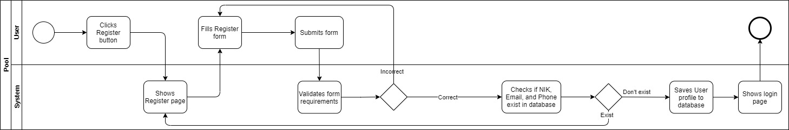
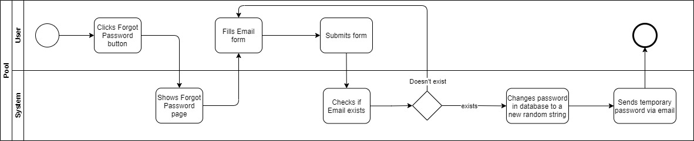
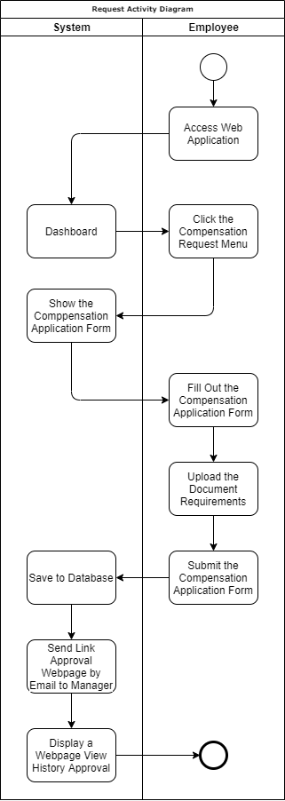
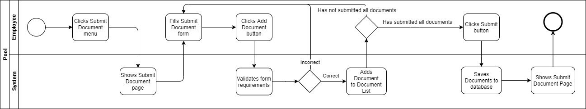
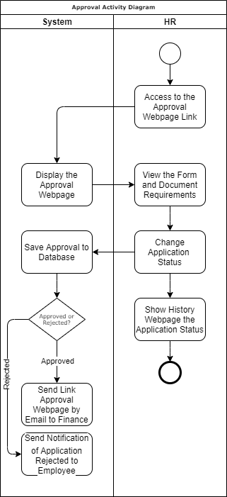
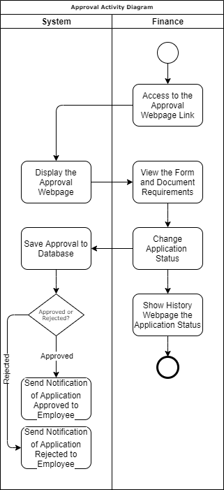

# Documentation Final Project

## Entity Relationship Diagram

## Use Case Diagram

## Business Process Model and Notation

## Activity Diagram
#### Register Activity Diagram

#### Login Activity Diagram

#### Forgot Password Activity Diagram

#### Employee Request Activity Diagram

#### Submit Document Activity Diagram

#### Manager Approval Activity Diagram

#### HR Approval Activity Diagram

#### Finance Approval Activity Diagram

